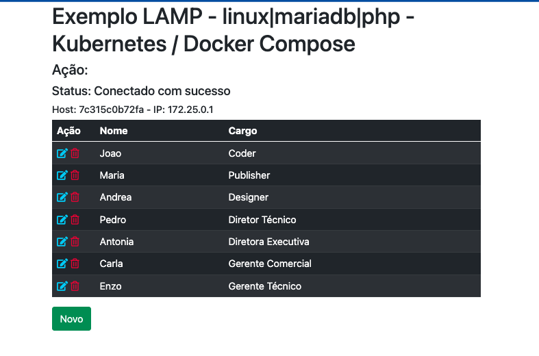

# kubernetes LAMP - linux|mariadb|php
### Basic Tutorial to create manifests to deploy app php in kubernetes environment

Exemplo básico com o objetivo de ensinar containers docker em um ambiente kubernetes

Este exemplo foi criado em um pc local com:
* Windows 11
* Docker Desktop com Kubernetes ativado
  + Será necessário o comando kubectl. Link p/ o site do [Kubernetes](https://kubernetes.io/docs/tasks/tools/)
  + Vamos instalar também o minikube, que também está no link acima, para ter uma visão kubernetes como o GCP por exemplo.
* IDE a gosto, no meu caso utilizei o VSCode

# Explicando o que contém no repositório

### diretório yaml-maria/
* contém o manifesto deployment.yaml que cria o serviço db (no caso mariadb) e também sobe o deployment com 1 pod para o host db
  + subirá o serviço na porta padrão 3306
* contém o volume.yaml que criará um volume persistente, ou seja, em caso de reinicio do serviço, os dados não serão perdidos
  + importante reforçar que este script é um exemplo simples, com usuário e senha exposto no código
  + uma boa prática é utilizar secrets, mas como o objetivo é de introdução, seguiremos com este exemplo
* importante: o container do mariadb terá acesso somente interno, ou seja, somente os serviços do cluster que será criado

### diretório yaml-php/
* contém o manifesto deployment.yaml que cria o deployment para subir 3 pods o serviço web
  + esses pods contém uma aplicação simples de cadastro de pessoas 
  + e essa aplicação se conecta com o mariadb 
* contém o manifesto service.yaml que cria e sobe o serviço web (apache e php)
  + subirá o serviço na porta padrão 8080
  + neste exemplo, subiremos o serviço em nodeport, ou seja, além dos hosts do cluster, o seu PC também terá acesso ao serviço
  + Quando subimos um ambiente kubernetes, essa aplicação tem que estar disponível para a internet ou seja, LoadBalancer. 
  + Então, para subir a aplicação em loadbalancer, deixei comentado no script. Neste caso, é só comentar o trecho nodePort e descomentar o LoadBalancer

### diretório yaml-pma/
* contém o manifesto deployment.yaml que cria o deployment para subir 1 pod o serviço de PHPMyAdmin
  + esses pod contém o PHPMyAdmin, uma aplicação opensource para gerenciar o banco de dados mariadb
  + e essa aplicação se conecta também com o mariadb 
* contém o manifesto service.yaml que cria e sobe o serviço web (apache e php)
  + subirá o serviço na porta padrão 8081
  + Para esta aplicação estar disponível na internet, terá que fazer a mesma coisa em relação nodePort para LoadBalancer.
  
### script kube.bat
* script criado como bat file (windows). Para linux, é só adaptá-lo.
* este será sempre utilizado para subir os manifestos no cluster (manifesto do mariadb, da aplicação web php e da aplicação phpmyadmin)
* o core deste script está conceituado no comando kubectl para aplicar manifestos yamls ou para excluí-los
* contém as ações start e del
  + start, sobe o serviço, deployment e seus pods e também o replica set
  + del, remove todos os serviços, deployments, pods e replica set
  + comando: kube.bat start, kube.bat del ou somente kube.bat para listar os serviços e deployments
* sugiro aprender sobre os comandos kubectl para poder se aproveitar de mais comandos interessantes do kubernetes

# VAMOS EXECUTAR AGORA ESSA APLICAÇÃO NA SUA MÁQUINA
* instale todas as aplicações comentadas anteriormente
* abra o docker desktop e, em configurações, veja se o kubernetes está ativo. Senão tiver, ative-o
* para criar o cluster, basta acionar o script cluster.bat
  + cluster.bat start meucluster
* aguarde a conclusão e após isso, execute o comando kube.bat start
* aguarde alguns instantes execute o seguinte comando kube.bat [sem nenhuma ação] ou o comando kubectl get deploymnts até obter o resultado abaixo:
XXXXXXXXXXXXXXXXXXXXXXXXXXXXXXXXXXXXXXXXXXXXXXXXX

* Nosso setup está configurado para ter:
  + 1 pod para o db, 3 pods para o lamp e 1 pod para o phpmyadmin. 
  + enquanto o Available não conter as devidas quantidades, aguarde a aplicação subir completamente.
  
* Após o resultado do comando kubectl get deployments estiver como acima é só acessar as ferramentas no browser:
  + [App php](http://localhost:8080)
  + [PHPMyAdmin](http://localhost:8081)

* para visualizar o ambiente kubernetes como os ambientes cloud como GCP, Digital Ocean e outros:
  + se não instalou, instale o minikube
  + execute o comando minikube start
  + e por fim execute o comando minikube dashboard. Após sua conclusão, ele abrirá uma aba no seu navegador.
  
  
# ALTERAR O AMBIENTE
* esse processo é simples, vamos imaginar que queremos diminuir ou aumentar o número de replicas da aplicação web php. Para isso:
  * na aba do minikube dashboard
  + edite o arquivo yaml-php/deployment.yaml, altere o valor de replicas de 3 para 4
  + salve o arquivo
  + execute o comando kube.bat start [neste caso ele somente atuará no deployment alterado acima
  + após isso, acesse a aba do seu minikube dashboard e verá que o número de pods do deployment imc-lamp7 será 4/4
  
  

# EXCLUIR O AMBIENTE
* basta dar control c no minikube dashboard
* executar o comando minikube stop

  
Espero que tenha contribuído para o seu aprendizado.
